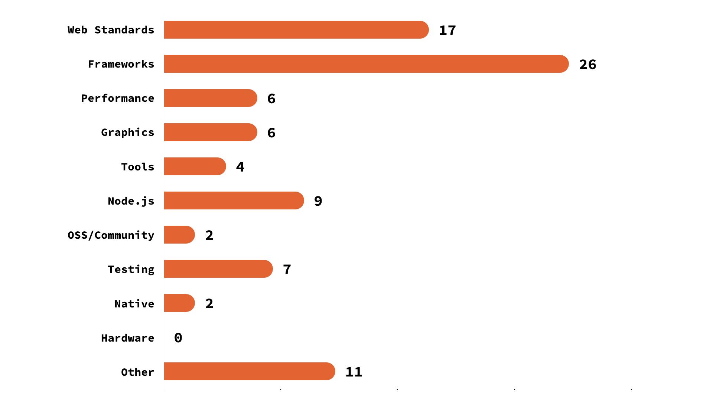
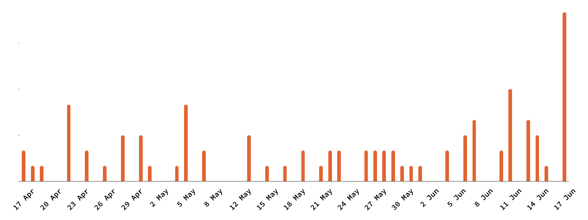
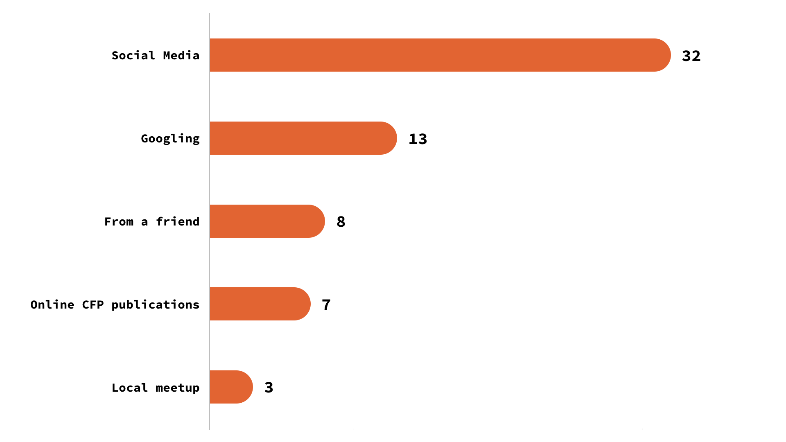

On June 17th 2019 the **Call for Speakers** for the first edition of [revo.js](https://revojs.ro) ended. As a wrap-up, we would like to share some statistics about the submission we received and the proposals which exceeded our expectations in terms of number, diversity, quality and topics.

We got **92 proposals** from **67 speakers**.

## Demographics

Except Africa and Antarctica, we've received proposals from all continents of the globe, which is something that we've never dreamed about, considering this is the first edition of our conference.

### Distribution by continent:

- **Europe - 45** (from 18 different countries, see breakdown below)
- **North America - 10** (USA: 9, Canada: 1)
- **Asia - 9** (Israel: 4, India: 4, Malaysia: 1)
- **South America - 2** (Argentina: 1, Colombia: 1)
- **Australia - 1**

<figure>
  
  <figcaption>revo.js CFP proposals distribution by continent</figcaption>
</figure>

### Distribution by European countries:

- 9 from Romania;
- 5 from UK;
- 4 from Netherlands;
- 3 from Poland, Hungary, Germany and Norway;
- 2 from France, Russia, Austria and Spain;
- 1 from Lithuania, Serbia, Finland, Portugal, Ireland, Belgium and Ucraine.

<figure>
  
  <figcaption>revo.js CFP proposals distribution by European countries</figcaption>
</figure>

## Topics

revo.js is dedicated to the entire JavaScript ecosystem, not focused on a specific technology. We expected a wide variety of topics from the CFP and the proposals truly raised up to our expectations:

- **Web Standards (17)**
  include anything regarding HTML, CSS, ECMAScript, DOM and Browser APIs, WebAssembly, Web Components, etc;
- **Frameworks &amp; Libraries (26)**
  include all framework and development libraries specific talks;
- **Performance (6)**
  includes any proposal regarding performance optimizations, weather its page/server load or regarding rendering;
- **Graphics (6)**
  include all proposals with an emphasis on 2D or 3D graphics, WebGL, animations, VR/AR and games;
- **Tools (4)**
  include any talks focused on DX (Developer eXperience) like debugging, code editors/IDEs, etc;
- **Node.js (9)**
  includes all talks that touch Node.js, server-side development, databases, serverless, etc;
- **OSS / Communities (2)**
  includes any proposal regarding Open Source ecosystem and JavaScript communities;
- **Testing (7)**
  testing is a huge topic, so this includes anything regarding unit, integration, end-to-end or any other type of testing;
- **Security (3)**
  includes all topics regarding security from Authentication, XSS, CSRF or any data protection;
- **Native (2)**
  in the context of JavaScript, Native development includes cross-platform Mobile technologies or Desktop apps;

<figure>
  
  <figcaption>revo.js CFP proposal distribution by topic</figcaption>
</figure>

We also got proposals that couldn't be included in any of the above topics, namely:

- 2 proposals each for: **Code Reviews**, **Leadership**, **Management**;
- 1 proposal for: **Ethics**, **History**, **JavaScript Fatigue**.

## Experience level

Another metric that played a minor role during our selection process was the experience level required to understand the topic. Of course, this is pretty subjective and hard to measure, so we left it to the speakers' appreciation to decide this:

- **Beginner**: 30 proposals
- **Intermediate**: 56 proposals
- **Advanced**: 3 proposals

<figure>
  
  <figcaption>revo.js CFP proposal distribution by experience level</figcaption>
</figure>

This distribution was exactly what we were looking for, because we wanted to have some Beginner and Expert level talks, but address the majority of presentations to intermediate developers, who make the most of our target.

## Submission date

Not a very relevant metric, but an interesting one was to see when do speakers submit their proposals during the course of the CFP. Talking to other conference organizers, we expected to receive the majority of the proposals during the last week.

<figure>
  
  <figcaption>revo.js CFP proposal distribution by submission date</figcaption>
</figure>

But looking at the chart, even though the last week got a lot of submissions, the distribution was a lot more uniform than we expected.

## Aquisition

Last but not least, we've asked the speakers where did they hear about revo.js Call for Papers. It's not a surprise that Social Media was the most frequent answer.

<figure>
  
  <figcaption>revo.js CFP proposal distribution by acquisition</figcaption>
</figure>

What amazed us was that word-of-mouth played an important role and 12% of the speakers submitted their proposals because of a friend’s recommendation. Huge props to those speakers and their friends.

Also, we were really happy that we got submissions from online CFP publications and we want to send them a big **revo.thanks**:

- [confs.tech](https://confs.tech/)
- [cfpland.com](https://www.cfpland.com/)
- [developeravocados.net](https://developeravocados.net/)
