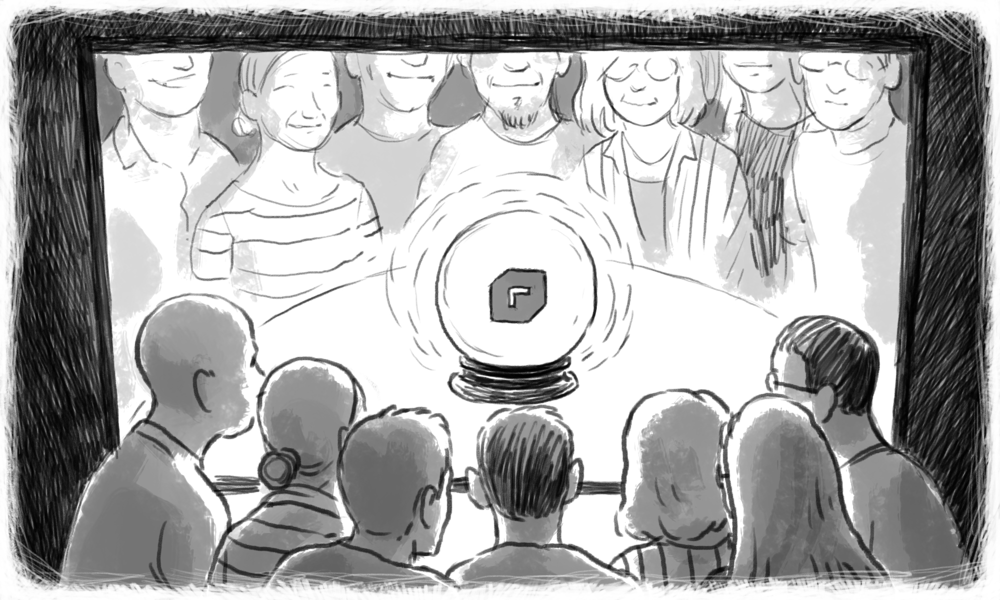

Between the **2nd and 4th of October 2019**, the first edition of [revo.js](https://revojs.ro/2019), a single-track, not-for-profit, community-driven JavaScript conference, took place in Timișoara.

The event gathered more than **200 participants** and **17 speakers** from 12 countries, during two conference days. To spice things up, we also held **a full-day workshop** which was fully booked.

---

To make it all happen, we started organizing revo.js one year in advance and we can tell you the overall process was an incredible ride.

Now we need to take a break and reflect in order to restart.

## Costs breakdown

Since revo.js was highly influenced by [JSHeroes](https://jsheroes.io/), we want to follow their example in creating an [Annual Transparency Report](https://medium.com/cluj-javascripters/jsheroes-2018-transparency-report-part-2-follow-up-eadce2a986bf) and share with you a high-level financial overview.

**Our total costs for revo.js 2019 were 56.000 EUR**:

- **14.500 EUR** for the venue, food and beverages;
- **16.000 EUR** for the speakers’ travel and accommodation;
- **13.000 EUR** for services’ fees: design, live captions, ticketing platform and other related services;
- **4.000 EUR** for audio/video/photo services, technical staff and equipment;
- **3.000 EUR** for revo.swag: t-shirts and key-chains;
- **3.000 EUR** for prints: badges, sponsors’ panels, posters and branding elements;
- **2.500 EUR** for other things: diversity support, online tools, etc.

The initial estimated budget was 60.000 EUR, but we managed to **gather 73.000 EUR**, which was far more than we anticipated:

- **46.500 EUR** from sponsorships;
- **26.500 EUR** from tickets;
- Some costs were also covered by our partners.

We also raised money from the donations made by participants in exchange for branded swag. These funds will be entirely donated to the [IRIS high-school](https://www.facebook.com/Liceul-Teoretic-Special-Iris-Timi%C5%9Foara-2221221011535265/) for visually impaired children. Even though the initial plan was to give away only 50% of the total donated amount, we finally decided to **donate all 850 EUR**.

## What about the extra money?

The first edition of revo.js made a **profit of 17.000 EUR**, which exceeded our initial expectations. Since revo.js is a not-for-profit event, we will use the extra money to grow the local JavaScript community as well as to give back to the global community.

### Support different JavaScript initiatives

We are planning to donate a part of the total profit to various JS community causes, such as open-source or underrepresented tech initiatives.

### Grow the local JS community

We plan on using a part of our earnings to bring speakers outside Timisoara to our tim.js meetup and also to organize various hands-on JavaScript workshops.

### Make revo.js better

We’ll use the remaining money to make the next revo.js edition even better. We’ve already identified a few key aspects we need to work on, but we’ll make sure to surprise you with some additional improvements.

## What went well?

Thanks to the feedback we received from both speakers and participants, we identified the most appreciated aspects of the conference.

### Registration process

We had almost zero queues during the registration, thanks to our experimental registration process, which we’ll explain in an upcoming article.

### Live captions

One of the highlights of the conference was **Orla** from [MyClearText](http://www.mycleartext.com/). Having live subtitles during a conference brings so many benefits, not only for hearing impaired participants, but also for those who are not native English speakers or for those who missed a few seconds of the talk.

### The content

Of course, at the heart of any technical conference are the talks, which in our case were extremely appreciated and were described by participants through the use of adjectives such as "**diverse**", "**professional**", "**high-quality**", "**useful**".

### Community feeling

revo.js was born as a community-driven event and we are very happy that we managed to build the feeling of community among our speakers and participants.

### Engaging after-party

We were pleasantly surprised by the high number of participants and speakers that attended the [after-party](https://www.facebook.com/pg/revojsro/photos/?tab=album&album_id=520281835197831). Those who didn’t interact that much during the conference had a second chance to do so at the after-party, where everything changed for the better.

### Not focused on recruitment

revo.js was not designed to be a recruitment-focused event and we wanted to make it visible. Our participants highly appreciated the approach and even felt more inclined to network and create authentic connections in the community.

Shifting the focus from recruitment to meaningful engagements benefited participants and sponsors alike. In fact, by stepping away from traditional booths and recruitment materials, our sponsors managed to incite participants with exciting activities and ignite natural conversations.

## What’s next?

Alright. Many things went great, but we were far from perfect. Here are the aspects we’ll strive to improve or change for next year’s edition.

### Better sound

Sound is a vital aspect of any conference and we know we had some quality fluctuations during our first edition. That’s why one of our top priorities for revo.js 2020 will be to have **top-notch sound** both at the conference and on the recorded videos.

### Food & beverage diversity

We read all your feedback and we hear you! We’ll do our best to provide a **broader range of food options for lunch and beverages during breaks**. What’s more, we’ll tweak the logistics process (table setting, food distribution, coffee vending machines placements) to reduce queues as much as possible.

### Facilitate interaction with the speakers

This year, we opted for longer breaks in order to enable participants to interact with speakers. Next year, we plan to encourage interactions even further by **introducing engaging activities that will facilitate participants-speakers networking**.

### More workshops

Last but not least, **we’ll increase the number of workshops**. We know that during a 30 minutes talk our speakers cannot cover a topic in depth. That’s why we plan to have at least three workshops, both introductory and advanced, to allow participants to deep dive into a particular subject and get hands-on experience.

## Here we go again

Now that we all know what went well and what could go better, it’s time to start planning the next revo.js edition.

We hope you’re as excited as we are. Details will follow soon.
