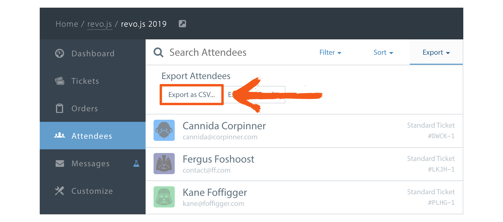
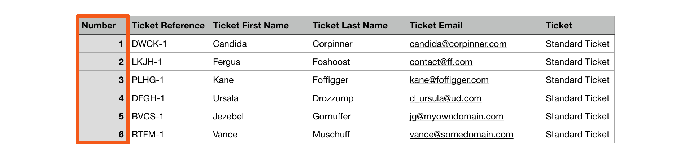
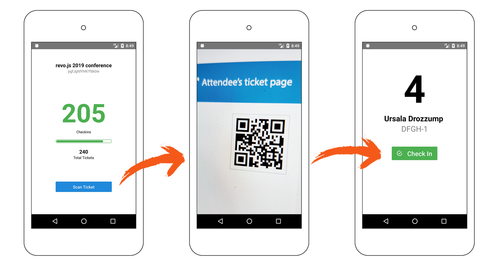
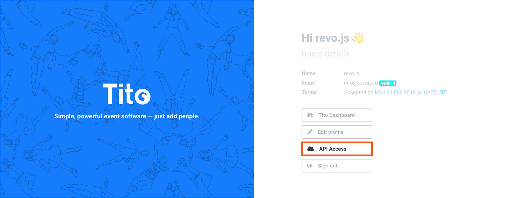
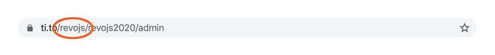

On the 3rd of October 2019, at 7:00AM, a bunch of excited people in orange t-shirts were taking care of the finishing touches before kicking off [revo.js](https://revojs.ro/2019), the very first JavaScript conference in Timisoara.

<!-- With just one hour left, the registration area was all prepped-up. The badges were strategically laid out for quick grabs and crew members had their phones fully charged for using our very own registration app. -->

We wanted the revo.js experience to have a great start, and that meant we needed a **flawless registration process**.

Keep reading if you want to know how we did it.

---

## Registration approaches

The countless experiences we had as conference participants helped us to identify 3 different ways of handling the registration process, each with its own pros and cons.

### 1. Printing all badges in advance

**Pros:**

- High-quality badges that can become collectible items for avid conference/festival goers (you know who you are).

**Cons:**

- Searching a badge by name can take a long time, even if you devise a solid system.
- Errors are easy to slip in, very often caused by the first/ last/ third name confusion.
- Tickets are often re-assigned, so printing in advance can turn out to be somewhat wasteful.

### 2. Have nameless badges and print name stickers on site

**Pros:**

- Save precious time and eliminate the hassle of searching for a specific badge.
- Last minute re-assigns are not an issue, because you always print the latest attendee information.

**Cons:**

- Scaling involves additional costs, because you need to have multiple printers.
- The print will be low quality.

### 3. Print nameless badges and write names by hand

**Pros:**

- A less, close to no-waste method.
- Easily scalable by adding multiple people at the registration table.

**Cons:**

- Unless you have a very beautiful hand-writting, the result might look unprofessional;
- Spelling mistakes can easily creep in.

---

After thoroughly considering all the pros and cons, we ended up going for the first option. We decided to print all the badges in advance because we felt our participants and speakers deserve the best quality badges.

But we had to figure out a way to make the process as fast as possible and avoid long queues.

## Rethinking badge identification

Searching badges by name can take quite some time, even a few minutes.

Badges are usually **grouped by the first letter of the first name**. However, it’s not always trivial to determine which one is the first name because:

- Participants could mix their first and last name when they purchase the ticket;
- Some participants have 3 or even 4 names.

### What about searching by number?

It’s not hard to figure out that if each ticket would have a unique incremental number, the search process would be much easier.

We used [ti.to](https://ti.to/) as the ticketing platform and it worked great during the ticket sale. They even have a [mobile app](https://ti.to/docs/checkins#use-the-ios-or-android-app) to scan the ticket QR code and check-in attendees at the event.

Unfortunately, it only returns the attendee’s full name and a unique non-incremental identifier, like **DFGH**, which isn’t of much help when you’re looking to identify a badge. We came to the conclusion that we needed an alternative to achieve what we wanted.

---

Since half of our organizing team was made of developers, we figured: why not create one ourselves? So we did.

We created a [custom registration app](https://github.com/tim-js/tito-registration) and we’re open sourcing it so other organizers can benefit from it as well.

## A new ti.to registration app

As we mentioned before, the ti.to check-in app did not display a unique, incremental identifier. However, when you export the attendees lists in CSV format, such a number actually gets generated. Fortunately, ti.to also exposes an [Admin API](https://ti.to/docs/api/admin/#tickets-get-a-ticket) you can query to retrieve it.

<figure>
  
  <figcaption>How to export attendees list from ti.to</figcaption>
</figure>

<figure>
  
  <figcaption>Exported attendees list</figcaption>
</figure>

The ti.to app also has a check-in feature that lets you know at any point who registered, how many attendees are yet to arrive etc. This is of utmost importance and, even if at the beginning we aimed only to retrieve a unique identification number, we decided in the end to also replicate this feature from the ti.to app, by using the [Checkin API](https://ti.to/docs/api/checkin#check-ins-create-a-check-in).

<figure>
  
  <figcaption>Retrieving the unique number ID</figcaption>
</figure>

---

### How does it work?

- You **scan the ti.to generated QR code** from the participant’s phone;
- The app displays the **unique number ID**;
- You **check-in the attendee** through the ti.to platform;
- Search for the badge containing the **unique number ID**.

<figure>
  
  <figcaption>Easily find the badge by their number id</figcaption>
</figure>

Thanks to it, we managed to reduce the total registration time of each participant to **just a few seconds**.
We had a team of 4 people at the registration desk, and there were no queues at any point.

## You can use it too!

As we’ve said, we have open sourced the app, published it and made it super easy to use, so other event organizers can benefit from it. Here’s what you need to to:

### Before the event:

1. **Export your attendees list** as a csv file; <screenshot>

- **Print their corresponding number ID on the badge**, along with their name; 
- **Have the badges sorted by number**, preferably in batches of 10-20;
- **Install the app** on your mobile device, available for [Android](https://play.google.com/store/apps/details?id=com.revojs.registration) and [iOS](https://apps.apple.com/us/app/ti-to-registration/id1483743059);
- Add your ti.to credentials: **Api Key** generated at [id.tito.io](https://id.tito.io/api-access-tokens) and your **Team Slug** from your event url;
- **Create check-in lists** in ti.to, which will be automatically imported in the app.

<figure>
  
  <figcaption>Generate an Api Key from <a href="https://id.tito.io" target="_blank" rel="noopener noreferrer">id.tito.io</a></figcaption>
</figure>

<figure>
  
  <figcaption>Find your Team Slug in your event url</figcaption>
</figure>

### During the event:

7. **Scan the ticket QR code** from the participant’s phone;

- **Check-in the participant** to keep track on the progress;
- **Find the badge** with the corresponding number.

For attendees without the QR code, you can **easily search the exported CSV file** by their name, to retrieve the corresponding number ID.

## Tell us what you think

If you’re an event organizer and use ti.to as the ticketing platform, you might want to try our registration process.

But even if you use a different ticketing solution, you can still apply the same approach for finding the participants' badges.

If you have any questions or ideas on how to improve it even further, please reach out at [info@revojs.ro](mailto:info@revojs.ro)
